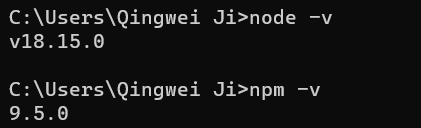

# 2023.03.16-Github+NodeJS+Hexo搭建个人博客

> 前提：注册完github个人账号并完成git配置SSH key

### 1、安装Node.js

> 参考：建议安装在D盘
>
> https://zhuanlan.zhihu.com/p/105715224
>
> https://www.cnblogs.com/matanzhang/p/11441693.html

（1）访问nodejs官方地址，下载对应的安装包，进行安装（简单的点击下一步）。

（2）安装好之后，配置环境变量，并在终端里面输入：node -v




问题：npm安装报错（operation not permitted, mkdir 'C:\Program Files\nodejs\node_cache\_cacache'）


解决：

（1）改变windows权限（推荐）

https://blog.csdn.net/kking_edc/article/details/128368374

（2）清楚缓存（有用-方法一）

https://blog.51cto.com/u_15127553/3756831

### 2、安装Hexo

> 参考：
>
> https://zhuanlan.zhihu.com/p/105715224
>
> https://zhuanlan.zhihu.com/p/392994381

首先在D盘建立一个文件夹 Blog，点开 Blog 文件夹，鼠标右键打开 Git Bush Here，输入npm命令初始化Hexo：

```text
hexo init
```

报错：


网上解释说是github被墙了，反正尝试了很多方法，都不行，然后看到了这条命令

```
hexo init blog
```


尝试后发现成功了

所以就把原先创建的Blog删除了，直接在D盘中右键”Git Bash Here"，结果又报错（内心OS：到底是怎样）


还是用了上面的方法，结果如下：


```
生成静态网页
命令：hexo g
预览
命令：hexo s
```


> 这样是不对的，正确的参考：https://zhuanlan.zhihu.com/p/105715224

因为没有在D:\Blog\blog里进行bash，所以正确的如下：


然后访问：http://localhost:4000/


看完之后 ctrl +c 停止运行服务器。

### 3、将Hexo部署到GitHub

现在回到我们的 blog 文件夹，用记事本打开 _config.yml 文件，如下图：


下滑到文件底部，填上如下内容：

repository仓库地址改为自己的

branch看自己的github仓库是master还是main，我这里是main，所以就填写main

```text
deploy:
  type: git
  repository: https://github.com/QingweiJi/QingweiJi.github.io.git
  branch: main
```


然后回到 blog 文件夹中，打开 Git Bash，安装Git部署插件，输入命令：

```text
npm install hexo-deployer-git --save
```


然后分别输入以下三条命令：

```text
hexo clean   #清除缓存文件 db.json 和已生成的静态文件 public
hexo g       #生成网站静态文件到默认设置的 public 文件夹(hexo generate 的缩写)
hexo d       #自动生成网站静态文件，并部署到设定的仓库(hexo deploy 的缩写)
```

第三个命令报错，导致输入https://QingweiJi.github.io/显示404


> 解决方案：
>
> https://stackoverflow.com/questions/74250806/i-have-question-when-creating-blog-with-github
>
> https://hexo.io/zh-cn/docs/github-pages.html